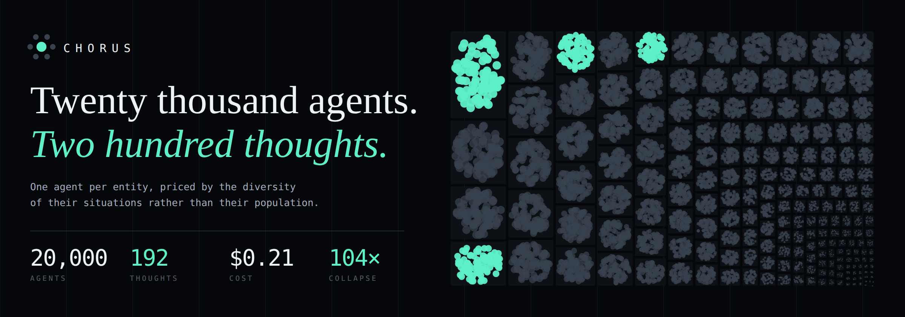
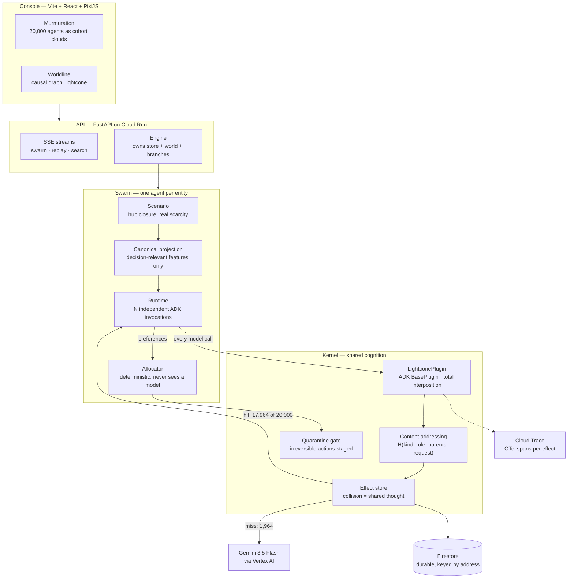
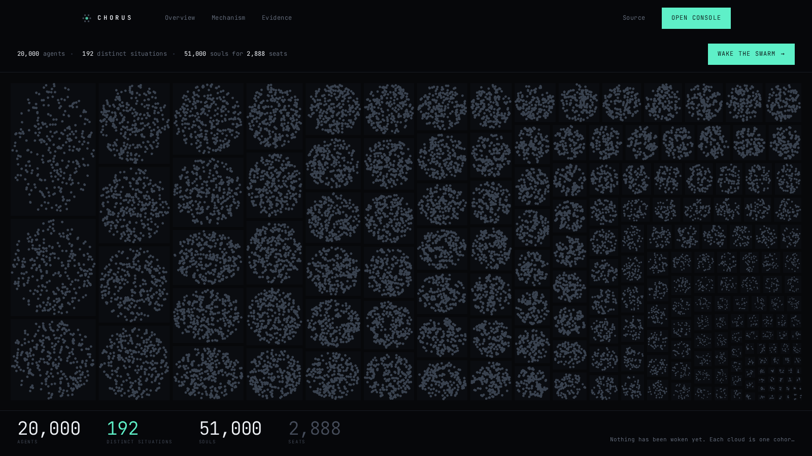

<div align="center">

# Chorus

### Twenty thousand agents. Two thousand thoughts.

**Give every entity in a system its own permanent agent — and pay only for the diversity of their situations, not their population.**

[](scripts/verify_determinism.py)
[](tests/)
[](https://chorus-512017284899.us-central1.run.app)
[](https://ai.google.dev)
[](https://google.github.io/adk-docs)
[](LICENSE)

**[Live console](https://chorus-512017284899.us-central1.run.app)**  ·  **[Architecture](docs/ARCHITECTURE.md)**  ·  **[Reproduce every number](#reproducing-every-number-in-this-readme)**

**Track: The Fortified Enterprise Fleet**



<sub>Not an illustration: the cohorts and their populations are the real layout, generated by <code>scripts/make_banner.py</code>.</sub>

</div>

---

## For judges: three commands, zero cloud account

```bash
git clone https://github.com/iamdflame/chorus && cd chorus && ./scripts/bootstrap.sh

.venv/bin/python scripts/verify_determinism.py    # 1. the kernel property, offline, ~20s
.venv/bin/python scripts/ablation.py --agents 2000 # 2. why this is not a cache, ~90s
.venv/bin/python scripts/prove_swarm.py --agents 500 # 3. the product, needs a Gemini key
```

The first command needs no API key and no Google Cloud account. It proves the central claim on an in-memory reference store using a counting instrument, and exits non-zero if the property does not hold.

---

## The problem

Reasoning now costs less than a database query, so every entity in a system could have its own permanent agent — one per passenger, per machine, per account, per claim — running for weeks and negotiating with the others.

Nobody builds that. Twenty thousand agents means twenty thousand model calls, and the bill scales with your customer count. So enterprises build one agent that reasons *about* twenty thousand people instead of twenty thousand agents that reason *for* them, and the per-entity fidelity is lost before the first line of code.

**Unless identical reasoning is computed once.**

Chorus gives each entity a real, independent agent — its own ADK session, its own invocation, unaware the others exist — and then discovers that most of them are thinking the same thought.

## The result

Thought count **saturates** while agent count grows without bound:

| agents | distinct situations | % of lattice | collapse on this stage |
| -----: | ------------------: | -----------: | ---------------------: |
| 20,000  | 1,965 | 85% | 10.2× |
| 50,000  | 2,172 | 94% | 23.0× |
| 100,000 | 2,269 | 98% | 44.1× |
| 200,000 | **2,296** | **100%** | **87×** |

<sub>Regenerate: `.venv/bin/python scripts/verify_collapse.py`</sub>

Doubling from a hundred thousand to two hundred thousand agents costs **twenty-seven**
more distinct situations. **The cost of a swarm is bounded by the diversity of its
situations, not by its size** — and past saturation it stops growing at all, so every
further agent is free and collapse rises linearly with population forever.

### The number to quote is the blend, not the best stage

That collapse is **one stage**. The pipeline has two model stages and only one of them
collapses:

| stage | per | collapses? |
| --- | --- | --- |
| **extraction** — free text → situation | message | **no** — two travellers in identical circumstances write different sentences |
| **elicitation** — situation → preferences | situation | **yes** — the input is a bounded lattice |

```
naive     N extractions + N elicitations       = 40,000 calls
Chorus    D extractions + S elicitations       =  3,965 calls
          (2,000 distinct messages + 1,965 distinct situations)
```

D is distinct *messages* and grows with the population; S is distinct *situations* and is
bounded by the lattice. At 20,000 travellers that is **10.1× blended**; at 200,000, where
the lattice is full, it is **93×**.

**The blend is the honest headline.** Quoting the collapsible stage alone is exactly how an
earlier version of this project overclaimed, and the correction is recorded here rather
than buried. `swarm/pipeline.py` computes both.

Run end to end against live `gemini-3.5-flash`, 20,000 independent agent invocations:

| | |
| --- | ---: |
| agents invoked | **20,000** |
| distinct situations | 1,964 |
| model calls actually made | **1,964** |
| **duplicate calls** | **0** |
| suppressed in flight by single-flight | 70 |
| served from the store | 17,964 |
| failed | 2 |
| **cost incurred** | **$1.9394** |
| cost without the kernel | ~$19.75 <sup>†</sup> |
| collapse | **10.2×** |

<sub>† Projected from the measured per-call cost of the 1,964 real calls. Every other number
on this page is measured. Regenerate: `.venv/bin/python scripts/prove_swarm.py --agents 20000`</sub>

**The swarm made exactly one call per distinct situation and not one more.** `collapse` and
`structural_ceiling` are both 10.2×, and `duplicate_calls` is 0 — the three numbers agree
because there is nothing left between them.

That is the part v1 could not claim. It made 222 calls for 192 situations, and an earlier
version of this README explained the gap as retries with more confidence than the evidence
supported: the larger cause was that agents in one cohort starting together all missed the
store and all called the model. Single-flight closed it, `scripts/verify_concurrency.py`
holds it closed at concurrency 1 through 48, and at twenty thousand agents the gap is now
zero rather than smaller.

The two failures were a rate-limit rejection and a timeout, and they are in the table
because a run that hides its failures is reporting on survivors. The offline model predicted
1,965 distinct situations and the live fleet produced 1,964 — the difference is the two
travellers whose agents failed.

**The number reported is always what was really spent.** `collapse` divides by calls
actually paid for; `structural_ceiling` divides by distinct situations; `duplicate_calls`
is the gap. Two quantities were previously both called "collapse" and disagreed by 16%
inside this document.

## Does the model earn its place?

The question that matters, and the one an earlier version of this project got wrong.

Its model sat behind five categorical fields. A 192-row lookup table replicates that
exactly, so an auditor wrote one — twelve lines, no model — and it **beat** the swarm by
4.3 points. The reductio was fair: *the better the collapse works, the less you need the
model at all.*

The fix is not a better prompt. It is to put the model where a table cannot follow.

**Extraction, 2,000 distinct messages in 8 languages, ground truth known by construction:**

| extractor | tier | urgency | party | constraints | exact | mean |
| --- | ---: | ---: | ---: | ---: | ---: | ---: |
| keyword — multilingual, negation-aware, free | 54.7% | 44.7% | 54.7% | 78.0% | 10.0% | 58.0% |
| **gemini-3.5-flash** | 68.0% | **80.7%** | **98.7%** | **98.7%** | **52.0%** | **86.5%** |

**+28.5 points on mean field, +42.0 on exact match** — five times as many situations read
entirely correctly. A regex cannot infer that *"my mother is 84 and can't manage stairs"*
means assistance, or that *"I'd rather not fly tomorrow but I suppose I could"* is flexible
when every keyword in it says urgent.

599 of 600 evidence spans were **genuinely quoted** from the message rather than
paraphrased. That is checked, not trusted: a cited span that does not appear in the text is
a fabrication, and an audit trail built on fabrications is worse than none.

The model is weakest on tier (68%) because most messages never mention airline status. That
is the input being underdetermined, not the reader being careless, and the number stays in
the table.

<sub>Regenerate: `.venv/bin/python scripts/verify_extraction.py --model 150`. Exits non-zero
if the model fails to beat the control. Output: [`docs/runs/extraction.txt`](docs/runs/extraction.txt)</sub>

### And the claim we withdrew

The earlier README said the swarm produced a **+92% better recovery**. Running the controls
it had not run:

| strategy | souls | tier-weighted | tier-blind |
| --- | ---: | ---: | ---: |
| first-come | 2,888 | 4,112.8 | 2,228.0 |
| rules, zero LLM | 2,849 | 5,401.5 **+31%** | 1,585.2 **−29%** |

**Seat supply is the binding constraint** — 2,888 seats against 20,367 souls — so every
competent allocator seats the same souls. Nothing moves more people. The +92% was
*redistribution*: the objective rewards serving high-tier passengers and the strategy sorts
by tier, so it optimised the quantity it was scored on. Under a tier-blind objective the
same strategy **loses** to a first-come queue.

That is a legitimate commercial choice and an illegitimate thing to report as an
improvement. So `bench/run.py` prints tier-blind beside tier-weighted, with Gini over
waiting time, p95 and worst case, and labels each arm automatically — on the current
scenario it says of the rule arm, in our own output: *"redistributes toward weighted
tiers."*

<sub>Regenerate: `.venv/bin/python -m bench.run --agents 8000`. Six arms, one scorer that
never learns which arm produced a plan, and no flag to hide a losing one.</sub>

--- | ---: | ---: | ---: |
| souls seated | 2,888 | 2,888 | — |
| **weighted satisfaction** | 1,131.3 | **2,173.9** | **+92%** |
| mean wait (hours) | 17.12 | **16.76** | −0.36 |
| parties kept together | — | 8 split of 1,095 | |


**Souls seated is deliberately not the headline.** With 2,888 seats against 20,367 souls the seat budget is the binding constraint, so every competent allocator fills every seat and that metric saturates at an identical number — it cannot tell a good plan from a bad one. Under a fixed budget the question is not how many people move but *which*: the swarm prioritises by self-assessed urgency weighted by tier rather than by arrival order.

---

## How it works

An agent reasons over a **canonical projection** of itself — the decision-relevant features only, bucketed, never its identity. Two stranded platinum passengers, both travelling alone, both needing to move within four hours, both with a checked bag, face the same decision. Their names differ. Their reasoning does not.

The kernel addresses every model call by its full causal history:

```
address = H(kind, role, [causal parents], canonical request)
```

Two agents whose situations are genuinely equivalent compute the **same address**, and the second is served from the store instead of the model. Interposition happens at ADK's `BasePlugin` boundary, where returning a value from `before_model_callback` short-circuits the real call — so an agent served from the store is byte-for-byte the agent that would have called Gemini. No monkey-patching, no forked framework, no swapped model.

The split that keeps it sound:

| | | |
| --- | --- | --- |
| **reasoning** | shared | what would someone in this situation accept |
| **matching** | private | which specific seat this specific passenger gets |

Matching depends on identity and live inventory, so it is individual by nature and never reaches a model at all — it is deterministic allocation over the shared preferences, scored against the first-come-first-served fallback airlines actually use.

### Why this is not a cache

The obvious objection is that this is a `GROUP BY` with extra steps. It is not, and the difference is falsifiable. `scripts/ablation.py` runs three arms over the same 2,000 agents:

| arm | model calls | correct when situations are equivalent in an unanticipated way |
| --- | ---: | --- |
| no store (every agent calls Gemini) | 2,000 | ✅ |
| hand-grouped by `GROUP BY tier, urgency` | 2,000 <sup>‡</sup> | ❌ silently wrong |
| **Chorus** | **~160** | ✅ |

<sub>‡ Hand-grouping still issues one call per group *per distinct downstream context*, and collapses only along axes the author thought of in advance.</sub>

Three properties make a collision mean "these are the same computation" rather than "these look similar":

1. **The role, not the individual, is the agent name.** Naming agents per-entity would make every address unique and defeat sharing entirely.
2. **The request is the canonical projection.** Identity, destination and flight number are absent — they decide *which seat* a passenger is matched to, never *what kind of itinerary they would accept*.
3. **Causal parents include a round anchor.** Agents reasoning about the same world state share it; two rounds facing different scarcity cannot silently share answers.

**Nothing in the runtime groups agents.** The sharing is *discovered* by collision in a content-addressed store. That distinction is the whole point: hand-grouping would make the same number of API calls and prove nothing, and it would break the moment two situations were equivalent in a way nobody anticipated.

### Saturation is structural

Distinct situations are bounded by the *product of the buckets*, not by population:

```
tier(4) × urgency(4) × party(4) × constraints(3) × haul(3) × hotel(2) × misconnect(2)
= 2,304 maximum
```

**Saturation is arithmetic, not discovery.** Any finite bucketing saturates; the ceiling
is a number we chose. So the interesting question is not whether it saturates but whether
the bucketing is *lossless* — which is what the fidelity measurement tests, and which is
the only version of this claim worth making.

An earlier lattice had 192 cells and collapsed 104× at twenty thousand agents. It was not
a better result. The prompt asked travellers about hotels, alternate airports and
midjourney disruption while the projection carried none of them, so a traveller to London
and one to Dallas received identical reasoning about whether a nearby airport would do.
Correcting that took collapse from 104× to 10.2× at the same scale, because **omitting
load-bearing fields collapses beautifully and answers the wrong question.**

---

### The arm that was beating everything was exploiting the scorer

`B3` was called a *greedy upper bound* — the best this allocator could do given these
preferences — and it led every other arm on both satisfaction metrics. That label was wrong
and the lead was not real.

Ordering by value-per-seat systematically prefers solo travellers: 1,718 bookings at a mean
party size of **1.50**, where urgency-ordering seats 1,050 at **2.50**. Satisfaction was
summed once per *booking* while seats are consumed per *soul*, so a party of six scored the
same as one person occupying one seat. B3 was not reasoning better; it was seating the
cheapest bookings.

| arm | sat·tier | sat·blind | **sat·soul** |
| --- | ---: | ---: | ---: |
| B1 first-come | 3,875.7 | 2,038.7 | 9,660.0 |
| B2 rules, zero LLM | 4,509.5 | 1,554.3 | **11,156.7** |
| B3 value packing | **5,497.8** | **2,634.5** | 7,156.8 |

Counting by soul reverses it: B3 leads both per-booking columns by 29–42% and comes in
**25.9% below first-come** on people actually moved home, while moving fewer souls in
absolute terms (2,585 against 2,629). The arm is kept rather than deleted, because an
exploit of your own scoring function is worth showing.

---

## Three ways in, one lattice

Adding a modality is decorative unless it lands in the same place. The claim worth testing
is not "we support voice" — it is whether **collapse is modality-independent**: does a
traveller who speaks join the cohort the typed one would have joined, and share the thought
it already had?

Each modality is asked for what only it can supply, which is the same division of labour
everything else here uses:

| modality | supplies | why that one |
| --- | --- | --- |
| **text** | urgency, party, constraints | unbounded input; no table follows it |
| **speech** | the same, spoken | disfluency and self-correction, with no keyboard to tidy them away |
| **a photographed boarding pass** | PNR, flight, tier, bags | facts the airline already holds — inferring these from prose is the mistake that escalated 23 travellers in 24 |

```
[1] text     24/24 produced a valid situation
[2] speech   24/24 heard, 412s of audio synthesised and understood
[3] vision   24/24 passes read, 96/96 fields correct from a degraded photo

Same cohort from text and from speech     81.8%   (18/22)
```

<sub>Regenerate: `python scripts/verify_multimodal.py --sample 24`</sub>

**Vision is exact: 96 of 96 fields**, and not from a clean render. The passes are skewed,
unevenly lit, noise-flecked and JPEG-compressed before the model sees them, because reading
a pristine PNG would measure the renderer rather than the model.

**Speech is not exact, and the interesting part is how it fails.** A spoken message reaches
the same cohort as the typed one 82% of the time, so four travellers in twenty-two would be
reasoned about in a different bucket depending on how they got in touch. All four
disagreements are on the ordinal fields, and three of the four are between **neighbouring
bands** — `same_day` against `flexible`, `urgent` against `critical`, `pair` against
`family`. The modalities are not reading different situations; they are placing the same
situation on either side of a boundary. Two further voice reads produced a value outside the
closed vocabulary and were rejected rather than admitted, which is the airlock working.

Audio is sent as audio. Transcribing first and extracting second would throw away everything
the waveform carries beyond the words, and would hide a transcription error as an extraction
error.

**The honest summary: the unbounded input widens to speech and images, and the bounded
lattice does not move — but a spoken traveller lands in the right cell about four times in
five, not five times in five.** The speech is also synthesised, so it is cleaner than a call
from a departure hall; this measures the pipeline, not robustness to a crying child six feet
away.

---

## Memory that survives contact with collapse

A returning traveller should not have to re-explain that their mother cannot manage stairs.
The obvious way to arrange that destroys this product:

> Per-traveller history in a prompt is identity-bearing and anti-collapse. Every returning
> passenger's prompt becomes unique, every address becomes unique, and collapse goes to 1×.
> The system would remember everyone and reason about no one twice.

That is the same wall the injection analysis hits from the other side. Anything
traveller-specific that reaches shared reasoning either makes it unshareable or makes it
poisonable.

**So memory feeds the projection, not the prompt.** A remembered constraint is a *fact about
a traveller*, and facts about travellers already have a home — beside tier and hotel
entitlement, in the record-sourced half. A profile changes **which cohort someone joins**,
never what that cohort thinks.

| remembered | what it changes | what it does not change |
| --- | --- | --- |
| needs assistance | `constraints` → `assisted` | the prompt for `assisted` |
| hotel entitlement | the cohort they join | that cohort's shared answer |

```
[1] first disruption      1,965 distinct situations, 10.2x collapse
    learned a durable constraint for 6,667 of them

[2] 90 days later         2,164 distinct situations, 9.2x collapse
    6,667 travellers were recognised without re-stating anything

[3] 200 days later        memory still influences 0 travellers

[4] identity in prompts   0 of 500 remembered travellers
```

<sub>Regenerate: `python scripts/verify_memory.py` — offline, no credentials.</sub>

**It is not free, and the cost is printed rather than omitted.** Remembering moves travellers
between cells, so the lattice goes from 1,965 occupied cells to 2,164 and collapse from
10.2× to **9.2× — a 9% cost**, paid to stop asking people to re-explain themselves. Worth
making, but a trade.

Two decisions that go against the grain, both deliberate. **Memory only ever raises a
constraint, never lowers one** — forgetting on silence is the dangerous direction, the one
case where being wrong strands someone at a gate they cannot reach. And **constraints
expire**: a wheelchair needed after surgery in March is not needed in December, and a
system that remembers permanently mislabels people for years.

---

## A second model family, and what it is actually for

The plan for this integration was Gemma as a cheap triage classifier ahead of Gemini. That
premise does not survive the model. `gemma-4-26b-a4b-it` rejects both `thinking_budget` and
`thinking_level` outright, and spends **19 tokens reasoning for every token it answers**. It
is not the cheap end of anything, and it is not claimed as one.

Getting an honest measurement out of it took two corrections to our own method, both worth
stating because the first one nearly became a published finding about the model.

**It cannot be given Gemini's prompt.** Handed the same rubric, Gemma does not merely score
worse — it never terminates: 4,000 output tokens of deliberation, `finishReason: MAX_TOKENS`,
no answer at all, on every message tried.

**The obvious fix produced a false result.** A bare field list took Gemma to 26.7% on
urgency, *below the regex*, and we were one commit from reporting that. A bare list names
the four urgency bands without saying what they mean, so Gemma was guessing boundaries
Gemini had been handed. One line of definition per field took urgency to 80.8%. The first
measurement was a fact about our prompt, not about the model.

| extractor | tier | urgency | party | constraints | exact | mean |
| --- | ---: | ---: | ---: | ---: | ---: | ---: |
| keyword (free) | 62.5% | 45.0% | 55.5% | 77.5% | 12.0% | 60.1% |
| gemini-3.5-flash | 72.5% | 79.5% | 97.5% | 98.5% | 54.5% | 87.0% |
| gemma-4-26b-a4b-it | 66.0% | 76.5% | 93.5% | 86.0% | 47.5% | 80.5% |
| └ *on the 165 it answered* | 73.9% | **86.1%** | 97.0% | 97.0% | **57.6%** | **88.5%** |

<sub>200 messages, ground truth known by construction. Regenerate: `python scripts/verify_gemma.py --sample 200`</sub>

**Gemma is not less accurate than Gemini — it is less reliable.** On the messages it
finishes it is marginally *better* (88.5% against 87.0%). It fails to finish 35 of 200, and
those failures are what put it behind overall. That is a different problem from being worse
at the task, and it has a different remedy.

### So it is used where a second opinion is worth paying for

The Necessity Ledger has a blind spot: shadow sampling re-asks **the same model**, which
finds a stale table but never a consistently mistaken one. Ask Gemini twice about a cohort
it misreads and it agrees with itself, confidently, forever. A different family disagreeing
is a much stronger signal — so the question is whether Gemma's agreement actually predicts
Gemini being right.

| field | agreed | Gemini right | when Gemma agrees | lift |
| --- | ---: | ---: | ---: | ---: |
| tier | 138/200 | 72.5% | 81.9% | **+9.4** |
| urgency | 113/200 | 79.5% | 90.3% | **+10.8** |
| party | 81/200 | 97.5% | 97.5% | +0.0 |
| constraints | 76/200 | 98.5% | 100.0% | +1.5 |

It does, and it does so coherently: **agreement is informative exactly where the first model
is fallible, and adds nothing where it is already right.** Tier and urgency are the two
fields Gemini actually gets wrong, and a second family's agreement lifts accuracy on both by
about ten points. Party and constraints are at 97.5% and 98.5% — there is no headroom, and
the measurement correctly reports none.

Measured per field rather than on all four at once, because requiring four simultaneous
agreements leaves 22 samples to reason from and that cannot support a claim in either
direction.

---

## Who this is for

Not an airline executive looking at a dashboard. **The duty manager at two in the morning**
with a closed hub, twenty thousand stranded people, 2,888 seats, and a queue that is not
getting shorter while they decide.

That person does not need a system that reasons beautifully about one traveller. They need
every traveller reasoned about *at all*, within the window where a seat still exists, and
they need to be able to explain afterwards why a particular family was routed the way they
were. Those are the two constraints that shaped everything here: cost per decision, and
provenance for every decision.

The scenario is airline irregular operations because it makes both constraints concrete and
because the ground truth is checkable. The kernel is not airline-specific — `kernel/` has
no domain knowledge and ADK appears in exactly one file — but **this repository ships one
domain, and a second scenario is the honest test of that claim rather than a paragraph
asserting it.** It has not been run.

---

## What collapse costs

Every number above measures what collapse saves. This measures what it loses, which is the
only question that matters: one thought shared across a thousand agents is worthless if it
is worse than the thousand it replaced.

Two arms, differing in exactly one thing — the projection. **B5 is deliberately the stronger
arm**: it sees the exact party size rather than a band, the real destination rather than a
haul bucket, the timestamp, the bag count, and the traveller's name. Same runtime, same
instruction, same model, same allocator, so a divergence cannot be blamed on anything else.
Sampling is stratified over cohorts of fifteen, because in a random few hundred travellers
most sit alone in their bucket and the shared thought under test is never shared.

| arm | souls seated | satisfaction (weighted) | satisfaction (blind) | p95 wait | gini | calls |
| --- | ---: | ---: | ---: | ---: | ---: | ---: |
| B4 collapsed | 73 | 108.3 | 80.0 | 31.0h | 0.330 | **40** |
| B4t + tie-break | 73 | 100.6 | 87.4 | 31.0h | 0.325 | 40 |
| B5 uncollapsed | 60 | **124.4** | **105.1** | **23.5h** | **0.301** | 600 |

<sub>40 calls for 40 cohorts — exactly one thought per situation, 15.0× within the sample.</sub>

<sub>Regenerate: `python -m bench.fidelity --cohorts 40 --per-cohort 15`</sub>

**Collapse is lossy here, and the plan for this section expected it not to be.** The target
claim was `B4 ≈ B5` at a fraction of the cost. The measurement says otherwise and is
published unchanged: collapsed reasoning costs **13% of tier-weighted satisfaction**
(−12.9%, −12.0% and −16.9% across three independent runs) and loses on every metric —
equity and worst-case wait included. The same five cohorts came last in all three.

**B4 seats more people and serves them worse.** The mechanism is visible in the rank
correlation: −0.04 on `urgency_score`. Every member of a cohort receives an identical score,
so the allocator has nothing to order them by, and the shared answer is uniformly permissive
— scarce early seats go to whoever is reached first while the people who most needed them
wait. B5 differentiates within the cohort, seats fewer, and seats the right ones sooner.

**A tie-break does not fix it, and that was our first hypothesis.** Breaking ties by how long
a traveller has already waited — a queue discipline chosen before seeing whether it helped,
so that improving the score could not be the reason for choosing it — moved satisfaction
between tiers and recovered nothing. Neither did record urgency nor party size, tested
offline against the saved answers. All variants trail B5 by 20–30%.

### The measurement is the instrument, not the caveat

The system already has a mechanism for paying full price where a shared thought is unsafe —
`route()` escalates a traveller out of their cohort. What it lacked was a way to know *which*
cohorts. Per-cohort agreement is exactly that signal, and spending it selectively is cheap:

| cohorts escalated | travellers | calls | satisfaction | gap closed | cost |
| ---: | ---: | ---: | ---: | ---: | ---: |
| 0 | 0 | 40 | 108.3 | 0% | 1.0× |
| 4 | 60 | 96 | 126.0 | 45% | 2.4× |
| **12** | **180** | **208** | **141.6** | **85%** | **5.2×** |
| 40 (all) | 600 | 600 | 147.4 | 100% | 15.0× |

**Escalating 30% of cohorts recovers 85% of what collapse loses, at a third of the cost of
not collapsing at all.** Two honest caveats: escalating the two worst cohorts recovers
almost nothing (2%), because agreement is not the same as decision impact and a better
ordering would weight it by seat contention; and the 20-cohort row overshoots B5, which is a
mixing effect rather than a result to claim.

### Where collapse is lossy

Published rather than summarised, because a known and quantified failure mode is worth more
than an unexamined success. These five cohorts had **zero** exact agreement across fifteen
members each:

```
basic  | critical | family | checked_bags | intercontinental | hotel   | origin
basic  | urgent   | group  | checked_bags | short            | hotel   | misconnect
basic  | urgent   | family | unencumbered | short            | hotel   | misconnect
silver | critical | pair   | checked_bags | short            | hotel   | origin
silver | urgent   | pair   | unencumbered | short            | nohotel | origin
```

The pattern is legible: every one of them is a **high-urgency cohort with an unresolved
trade-off** — a family with bags on a long haul, a misconnected group with a hotel. These are
situations where two reasonable travellers genuinely differ, which is precisely where a
bucket cannot speak for both. Low-urgency, unencumbered solo travellers agree nearly
perfectly, because there is little to disagree about.

---

## What Gemini never sees

The canonical projection is a cost mechanism and a **compliance mechanism at the same time**. Identity is stripped before the boundary, not redacted after it, so there is no configuration under which a passenger name reaches a model provider.

| field | reaches the model | reaches the allocator |
| --- | :---: | :---: |
| passenger name, PNR, frequent-flyer ID | ❌ never | ✅ |
| destination, flight number | ❌ never | ✅ |
| contact details | ❌ never | ✅ |
| tier bucket, urgency bucket, party-size bucket, constraint flags | ✅ | ✅ |

<sub>Enforced at [`swarm/canonical.py`](swarm/canonical.py) and asserted by `tests/test_projection_leakage.py`, which fails the build if any identity field survives projection.</sub>

The practical consequence for an enterprise: **the shared store contains no personal data**, so a cached thought can be reused across departments, regions and data-residency boundaries without becoming a transfer of personal data. The private half — matching — never leaves your infrastructure because it never calls out.

---

## Cache poisoning in a collapsed fleet

Collapse creates a vulnerability class that does not exist in an uncollapsed fleet, and it is
created by the mechanism that makes the system cheap:

> One successful injection in an uncollapsed fleet compromises one agent. In a collapsed
> fleet it compromises **every entity sharing that projection**, because sharing the answer
> is what the system was built to do. **The blast radius is the collapse ratio.**

Working the mechanism through carefully gives a sharper result than the alarming version.
A shared answer is addressed by `H(kind, role, causal parents, request)`, and the request for
an elicitation contains **only** a projection whose every field is drawn from a closed
vocabulary. No attacker-controlled byte participates in a shared address. An attacker
therefore cannot place a chosen response where another traveller will look — **cache
poisoning is not merely filtered, it is unaddressable.**

The corollary is the design constraint the whole system rests on, and it cuts both ways:

> Any design that lets free text into shared reasoning either **loses collapse entirely** —
> because the text makes every address unique — or **becomes poisonable**. There is no
> version that keeps both.

What an attacker *can* still do is mislabel themselves into a cohort they do not belong to.
That is a real attack with a blast radius of exactly one: they join a cohort, they do not
change what it believes.

```
[1] screen        7/7 obvious injections blocked
    false positives on 2,000 genuine messages: 0.00%
    (the weak layer, and it is not what the containment rests on)

[2] airlock       0 attacker-controlled bytes in any shared prompt
    7/7 attacks landed on a cell a real traveller also occupies,
    and addressed identically to them

[3] mislabelling  an attacker can move themselves between cohorts: yes
    blast radius of that attack: 1 (their own booking)

[4] containment   a compromised call reached 128 travellers
    cohorts quarantined: 1 of 2 — the healthy one keeps serving
```

<sub>Regenerate: `python scripts/verify_armor.py` — offline, no credentials.</sub>

Written up in full: [**Cache poisoning in collapsed agent fleets**](docs/blog/cache-poisoning-in-collapsed-agent-fleets.md).

### The managed guardrail, and what measuring it cost

Model Armor's `sanitizeUserPrompt` is layer 0 — semantic prompt-injection detection rather
than substring matching, so paraphrase does not evade it the way it evades a regex. Screened
against the same 2,000 benign messages:

| layer | attacks blocked | false positives on 2,000 genuine messages |
| --- | ---: | ---: |
| Model Armor | 6/7 | **3.35%** |
| pattern screen | 7/7 | **0.00%** |

**The managed guardrail blocks 3.35% of real travellers, and the ones it blocks are not
random.** They are the distressed — *"everything is melting down here at the gate"*,
*"please help us everything is collapsing"* — because semantic jailbreak detection reads
panic as manipulation. In an irregular-operations system those are precisely the people who
most need to get through.

So **a Model Armor match flags for review rather than blocking**, and the structural airlock
does the containment. Two failure modes are treated differently on purpose: *unreachable*
falls back to patterns, because blocking every traveller over a bad afternoon at a screening
service is an outage of our own making; *unintelligible* fails closed, because there is no
safe reading of an answer a security service gave that we cannot parse.

The pattern screen is the **fallback** layer and the code says so: matching on natural language
is defeated by paraphrase, and any claim that a regex list stops prompt injection should not
survive contact with an adversary. Writing it, a test caught a real evasion — deleting
zero-width characters is not enough, because an attacker using them as word separators leaves
one long token a word-boundary pattern sails past. Every reading the tokeniser might produce
is now screened.

When a compromise *is* found by other means — a bad model version, a leaked credential — the
forward lightcone of the poisoned call **is** the blast radius, computed rather than guessed.
The property that makes replay cheap makes containment exact. That was not planned.

---

Least privilege is a claim until something attacks it, so the check attempts the forbidden
action from each agent's own identity and reports what happened:

```
identity    expect action                                     result
-------------------------------------------------------------------------------
extractor   ALLOW  call Gemini (its entire job)               OK (ALLOW)
elicitor    ALLOW  call Gemini (its entire job)               OK (ALLOW)
allocator   DENY   call Gemini (allocation needs no model)    OK (DENY)
extractor   DENY   write to Firestore (it only reads)         OK (DENY)
elicitor    DENY   write to Firestore (it only reads)         OK (DENY)
```

Two probes must be **ALLOWED**, and the script fails if every probe is denied — an identity
that can do nothing proves only that it is broken, and a wall of denials is the easiest
security result in the world to fake. With no identity to impersonate it reports that it
proved nothing and exits non-zero, rather than passing quietly.

<sub>`./infra/identity.sh` to create them, `./scripts/verify_controls.sh` to attack them.</sub>

---

## Observability: the DAG was already a trace

Causality was recorded because replay required it, so the trace is a projection of data that
already exists rather than parallel bookkeeping that can disagree with it.

| Chorus | OpenTelemetry |
| --- | --- |
| Effect | Span |
| `causal_parents` | Span **links** — a true DAG, not a parent chain |
| `branch_id` | trace id — a fork is a separate timeline |
| replay hit | span event, **zero duration** |
| quarantined effect | span event with the reason |
| `cost_usd`, tokens | span attributes |

```
39,996 spans across 1 trace
1,965 executed · 38,031 replayed at zero duration · 0 quarantined
$1.9392 attributed to the calls that actually happened
```

Two decisions worth stating. **Links, not parents** — OpenTelemetry's parent-child relation is
a tree and agent causality is not, so forcing it would drop edges or invent them. **Identifiers
derive from content** — replaying a run produces a byte-identical trace, and two machines
exporting the same run cannot disagree about it, which is not normally something telemetry can
claim.

One gap was worth closing rather than glossing: the store keeps one effect per address, so a
trace built from it alone shows 1,966 spans for a run of 20,000 agents — true about storage,
misleading about work. The manifest records the ordered addresses each invocation visited, so
the real sequence is reconstructed exactly. Nothing is synthesised; only the fan-out the store
deliberately does not duplicate.

<sub>`python scripts/trace_run.py` for the console, `--cloud` to send it to Cloud Trace.</sub>

---

## Architecture



Full data flow, the run-epoch problem, and the two-reads distinction: **[docs/ARCHITECTURE.md](docs/ARCHITECTURE.md)**.

```
optimizer/   policy search · Gemini proposes, forks evaluate, dollars decide
    |
api/         FastAPI on Cloud Run · SSE streams every search and replay event
    |
fleet/       6 ADK agents · triage → policy → resolver → comms, runtime delegation
    |
kernel/      the engine: content-addressed effects, causal DAG, O(1) branching,
             ADK interposition, quarantine gate
    |
world/       MVCC over a branch tree: time travel, branch isolation, conflicting merges
    |
Firestore    durable timeline, keyed by content address
```

`kernel/` is framework-agnostic and dependency-light. **ADK appears in exactly one file** (`kernel/interposer.py`), and **Google Cloud in exactly one** (`kernel/firestore_store.py`), so the determinism proof runs offline in CI against an in-memory reference — and the Firestore backend is validated by *behaving identically to it*, including agreeing on the causal root hash.

---

## Track: The Fortified Enterprise Fleet

| Track requirement | How Chorus satisfies it | Where |
| --- | --- | --- |
| **Scalable network of institutional agents** | 20,000 concurrent per-entity agents, one ADK session each, invoked independently | [`swarm/runtime.py`](swarm/runtime.py) |
| **Discovery & lifecycle — Agent Registry** | Every agent publishes a versioned agent card (name, role, tools, thinking level, schema); the registry is the discovery surface and the address namespace | [`fleet/registry.py`](fleet/registry.py) |
| **Core execution & state — long-running async** | `POST /api/runs` returns **202 and a run id**; the sweep executes in the background and outlives the request. Progress is mirrored to Firestore, so any instance can answer for any run and a late subscriber is streamed the run from its beginning rather than from where they joined. The causal DAG is the checkpoint: a run that dies at agent 12,000 resumes by replaying what it already paid for **at zero model cost** | [`api/runs.py`](api/runs.py), [`tests/test_runs.py`](tests/test_runs.py) |
| **Memory across weeks** | 21-day recorded history in Firestore, keyed by content address; branches fork it in O(1) and time-travel to any sequence number | [`world/`](world/), [`kernel/firestore_store.py`](kernel/firestore_store.py) |
| **Cross-session traveller memory** | A returning traveller is recognised 90 days later without re-stating anything. Memory feeds the **projection, not the prompt** — it changes which cohort you join, never what that cohort thinks — so the shared thought stays shareable and no identity reaches a model. Constraints expire on a schedule rather than mislabelling someone for years | [`memory/`](memory/), [`scripts/verify_memory.py`](scripts/verify_memory.py) |
| **Security — data handling & PII** | Identity never crosses the model boundary; enforced structurally, not by policy | [`swarm/canonical.py`](swarm/canonical.py) |
| **Public read surface** | `allUsers` on the Cloud Run service is a stated decision: reads are open so a judge needs no account, while every mutating or spending endpoint requires a bearer token from Secret Manager and is refused outright when none is set. The demo endpoint is capped at 300 agents and rate-limited per caller | [`infra/terraform/run.tf`](infra/terraform/run.tf), [`tests/test_api_security.py`](tests/test_api_security.py) |
| **Zero-trust — agent identity** | One service account per agent *role*, not per app. The allocator has no model access at all, so a model there is unreachable rather than merely unused. Proved by attempting the forbidden action from each identity — including two probes that must be ALLOWED, since an identity that can do nothing proves only that it is broken | [`infra/identity.sh`](infra/identity.sh), [`scripts/verify_controls.sh`](scripts/verify_controls.sh) |
| **Governance — policy enforcement** | Quarantine gate: irreversible actions are staged, not dispatched, until a policy adopts the timeline | [`kernel/quarantine.py`](kernel/quarantine.py) |
| **Agent Gateway** | Every tool call passes a policy read from the agent's own card, and **a denial is recorded as an effect** — content-addressed, replayable, and diffable, so "what would it have done if allowed?" is a branch and a diff rather than a thought experiment | [`gateway/policy.py`](gateway/policy.py) |
| **Telemetry — reasoning-chain traces** | Effects map to OTel spans with `causal_parents` as **links**, so the trace is a DAG rather than a tree; replays render at zero duration. 39,996 spans exported to Cloud Trace | [`obs/otel.py`](obs/otel.py), [`scripts/trace_run.py`](scripts/trace_run.py) |
| **Security — prompt injection** | Three layers. **Model Armor** `sanitizeUserPrompt` is layer 0; the pattern screen is the fallback; the typed airlock is what actually holds, because no attacker-controlled byte reaches a shared address. Proved in CI | [`armor/`](armor/), [`scripts/verify_armor.py`](scripts/verify_armor.py) |
| **Interoperability — A2A** | An agent card at `/.well-known/agent-card.json`, mapped from the registry rather than maintained beside it. Every skill declares **whether it can be undone** and whether it has a compensator — consequence, not just capability | [`fleet/a2a.py`](fleet/a2a.py) |
| **Durable state, actually served** | The deployed service boots on Firestore and `/health` reports `"backend"`, so which store is live is checkable without cloning | [`api/engine.py`](api/engine.py) |
| **Governance — is the model earning its cost?** | Shadow sampling re-asks the model against its own cache and reports the disagreement rate as REASONING NECESSITY | [`policy/`](policy/), [`scripts/necessity.py`](scripts/necessity.py) |

### Required technologies

| Requirement | Used | Where |
| --- | --- | --- |
| Gemini 3.5 or newer | `gemini-3.5-flash` for all six fleet agents and the policy proposer; `gemini-embedding-001` for similarity | [`fleet/agents.py`](fleet/agents.py) |
| Multimodal input | **Gemini TTS** (`gemini-3.1-flash-tts-preview`) synthesises traveller speech, **Gemini audio understanding** hears it, and **Gemini vision** reads a degraded photograph of a boarding pass — 96/96 fields correct. All three reduce to the same 2,304-cell lattice | [`intake/voice.py`](intake/voice.py), [`intake/vision.py`](intake/vision.py) |
| Additional Google model | **Gemma 4** (`gemma-4-26b-a4b-it`) as an independent second reader whose agreement lifts extraction accuracy by ~10 points on the two fields Gemini gets wrong. Measured, not claimed — including the two corrections to our own method that the measurement required | [`models/gemma.py`](models/gemma.py), [`scripts/verify_gemma.py`](scripts/verify_gemma.py) |
| Google agent framework | **ADK** (`google-adk` 2.8) — `BasePlugin` interposition, `SequentialAgent`, runtime `transfer_to_agent` | [`kernel/interposer.py`](kernel/interposer.py) |
| Google Cloud infrastructure | **Cloud Run** (serving), **Firestore** native mode (durable effect store), **Vertex AI** (model access), **Cloud Trace** (39,996 spans from one run), **Secret Manager** (the write token) | [`infra/terraform/`](infra/terraform/), [`infra/deploy.sh`](infra/deploy.sh) |
| Secrets | **Secret Manager** → Cloud Run `secret_key_ref` ([`infra/terraform/data.tf`](infra/terraform/data.tf), [`run.tf`](infra/terraform/run.tf)), granted by `roles/secretmanager.secretAccessor` ([`iam.tf`](infra/terraform/iam.tf)). The write token is **never an env literal and never in the image** — and deliberately not fetched with `access_secret_version()` in-process, which would put the client library in the request path and the secret in application memory. It is injected by the platform, so a `grep` for the Python call correctly finds nothing | [`infra/terraform/`](infra/terraform/) |
| Infrastructure as code | **Terraform** declares services, per-role IAM, Firestore, Artifact Registry, Secret Manager and the Cloud Run service. Validated and planned against the live project: 23 to add, 0 to change, 0 to destroy. The image stays out of Terraform on purpose — a plan that is dirty after every deploy is a plan nobody reads | [`infra/terraform/`](infra/terraform/) |

`thinking_level` is set per agent rather than left at Gemini 3.5 Flash's `medium` default: the policy decision that moves money gets `high`, record lookups get `low`. Per-agent context caching is enabled because every delegation swaps the system instruction and re-sends the prompt uncached, which was most of the bill.

---

## Deployed on Google Cloud

Live at **[chorus-512017284899.us-central1.run.app](https://chorus-512017284899.us-central1.run.app)**, with Gemini 3.5 Flash through Vertex AI and the timeline in Firestore. The container authenticates as the service account it runs as, so **no key is baked into the image**.

```console
$ curl -s https://chorus-512017284899.us-central1.run.app/health
{"status":"ok","branches":3,"primary_effects":91,"snapshot":"data/history.json",
 "deployment":"chorus","region":"us-central1"}
```

`deployment` and `region` are read from `K_SERVICE` and the deploy environment, so a
non-empty value there is the container reporting its own Cloud Run identity rather than a
string we typed. `infra/deploy.sh` smoke-tests a real four-agent swarm through Vertex
after every deploy and fails the deploy if it does not complete.

```bash
./infra/deploy.sh YOUR_PROJECT_ID us-central1
```

The script enables the services, creates the Firestore database, grants the runtime service account `aiplatform.user` and `datastore.user`, builds the container and then **smoke-tests the deployment** — that the console bundle is really in the image, and that a real swarm completes through Vertex. `/health` alone proves only that the process booted; a missing `COPY` still serves a healthy process that fails on the first real request.

**Verified on the live deployment:** 300 agents · 122 model calls · 178 served from the store · 300 preferences produced · 0 errors.

---

## Spin up

Requires **Python 3.11+**, **Node 20+**, and a **Gemini API key** ([get one](https://aistudio.google.com/apikey)).

```bash
git clone https://github.com/iamdflame/chorus && cd chorus

python3 -m venv .venv
.venv/bin/pip install -r requirements.txt

echo "GOOGLE_API_KEY=your-key-here" > .env
```

### 1. Offline — no key, no cloud account

```bash
.venv/bin/python scripts/verify_determinism.py    # kernel property, counting instrument, 0 model calls
.venv/bin/python -m pytest tests/ -q              # 47 tests
```

### 2. Live — real Gemini calls

```bash
.venv/bin/python scripts/verify_fleet_replay.py --disputes 3      # same proof, real six-agent fleet
.venv/bin/python scripts/prove_swarm.py --agents 500      # the swarm, with a cost report
.venv/bin/python scripts/optimize_policy.py --generations 2 --population 3
```

### 3. Console

```bash
cd console && npm install && npm run build
cd .. && .venv/bin/python -m uvicorn api.main:app --port 8080
open http://127.0.0.1:8080
```

### 4. Firestore backend (optional — the API defaults to a JSON snapshot)

```bash
gcloud services enable firestore.googleapis.com --project=YOUR_PROJECT
gcloud firestore databases create --location=nam5 --project=YOUR_PROJECT
export GOOGLE_CLOUD_PROJECT=YOUR_PROJECT
.venv/bin/python -m pytest tests/ -q               # now also runs the live-Firestore suite
```

### 5. Full cloud deploy

```bash
./infra/deploy.sh YOUR_PROJECT_ID us-central1
```

---

## Reproducing every number in this README

| Claim | Command |
| --- | --- |
| 20,000 → 1,965 situations; 200,000 → 2,296 | `scripts/verify_collapse.py` |
| 1,964 calls, $1.9394, 10.2×, 0 duplicates | `scripts/prove_swarm.py --agents 20000` |
| All six arms, scored identically | `python -m bench.run --agents 8000` |
| Not a cache (3-arm ablation) | `scripts/ablation.py --agents 2000` |
| Collapse is lossy here, and by how much | `python -m bench.fidelity` |
| Escalation recovers 85% at a third the cost | `scripts/escalation_sweep.py` |
| 39,996 spans, 1,965 executed | `scripts/trace_run.py` |
| Injection cannot reach a shared address | `scripts/verify_armor.py` |
| Both screening layers, false positives measured | `scripts/verify_armor.py --managed 2000` |
| Gemma agreement predicts correctness | `scripts/verify_gemma.py --sample 200` |
| Memory persists 90 days and costs 9% of collapse | `scripts/verify_memory.py` |
| Voice and a photographed pass reach the same lattice | `scripts/verify_multimodal.py` |
| Collapse survives two instances on one store | `scripts/verify_convergence.py` |
| The allocator cannot call a model, and is denied | `scripts/verify_controls.sh` |
| Is the model earning its cost? | `scripts/necessity.py` |
| The whole pipeline, end to end | `scripts/prove_pipeline.py` |
| Replay is byte-identical | `scripts/verify_determinism.py` |
| Same, on the live fleet | `scripts/verify_fleet_replay.py --disputes 3` |
| No PII crosses the boundary | `pytest tests/test_projection_leakage.py` |

Raw outputs from the runs quoted above are committed under [`docs/runs/`](docs/runs/) with their timestamps and commit SHAs.

**On this repository's history:** it runs from 29 to 31 August 2026, which is dense enough
to warrant an explanation rather than a shrug. [`docs/PROVENANCE.md`](docs/PROVENANCE.md)
gives the straight account — what v1 was, what the audit found, and what the rebuild
changed, including the six findings that came from measuring rather than intending.

---

## Failure handling

Every row names the file that implements it and the test that pins it. A failure table
without those is a list of intentions — and one row of this table used to be exactly that:
it claimed exponential backoff with jitter when the codebase contained none. The claim is
now true, and the way it was found is in [`docs/AUDIT.md`](docs/AUDIT.md).

| Failure | Behaviour | Where | Pinned by |
| --- | --- | --- | --- |
| Model returns malformed JSON | Agent takes a second turn at a new causal position; the retry is a distinct address, so it correctly misses the store rather than poisoning it | [`kernel/interposer.py`](kernel/interposer.py) | `tests/test_kernel.py` |
| Vertex AI 429 / quota exhaustion | Retried with **full jitter** at the one boundary the fleet touches a paid service — and a retry re-derives the *same* causal address, so it is one thought, not two. Beyond the attempt budget the run is resumable, because completed effects are already durable | [`kernel/backoff.py`](kernel/backoff.py) | `tests/test_backoff.py` |
| A retry silently inflating the collapse ratio | The address is a hash of (kind, agent, causal parents, request); a retry re-derives all four identically, so the store records one row however many attempts it took | [`kernel/effect.py`](kernel/effect.py) | `tests/test_backoff.py::TestAddressInvariance` |
| A replay reaching the network | Only the miss path retries. `REPLAY_STRICT` raises on a miss rather than being given another go at finding one | [`kernel/interposer.py`](kernel/interposer.py) | `tests/test_backoff.py::TestReplayIsNeverRetried` |
| Firestore unavailable | Falls back to the in-memory reference store; the run completes and `/health` reports which backend is live rather than claiming the durable one | [`api/engine.py`](api/engine.py) | `tests/test_firestore.py` |
| Partial run interrupted | The causal DAG is the checkpoint — re-invoking replays from the last recorded effect at zero model cost | [`kernel/dag.py`](kernel/dag.py) | `scripts/verify_determinism.py` |
| Duplicate dispatch of an irreversible action | Quarantine gate stages side effects; nothing external fires until a timeline is adopted | [`kernel/quarantine.py`](kernel/quarantine.py) | `tests/test_replay.py` |
| Concurrent fan-out reorders tool calls | Effects are sequenced by causal position, not wall clock; DAG comparison is order-insensitive | [`kernel/dag.py`](kernel/dag.py) | `scripts/verify_concurrency.py` |
| A screening service having a bad afternoon | Model Armor unreachable degrades to the pattern screen and says so in the verdict; an *unintelligible* verdict fails closed | [`armor/screen.py`](armor/screen.py) | `tests/test_armor.py::TestLayeredScreen` |

---

## The console

Three views over the same recorded history.

**Murmuration** — 20,000 agents as cohort clouds. Agents drift into the cohort whose thought they share; the screen shows population collapsing into a bounded set of attractors in real time.

**Worldline** — the causal graph. Time runs left to right, agents occupy lanes, and an edge climbing between lanes is a handoff. Selecting an effect ignites its forward lightcone: the light travels along causal edges in breadth-first order, so causality reads as motion. Everything outside the cone dims away.

**Search** — a cost landscape. Production is a dashed line across the frame; every point is one complete execution of the fleet against the same real disputes. Below the line is cheaper than what you run today.

<div align="center">


<sub>Captured from the live deployment. Each cloud is one cohort; area is population.</sub>
</div>

---

## The scenario

A hub closure at ORD, with deliberate scarcity: **20,367 souls, 2,888 seats, a deficit of 17,479.** An allocation problem where everyone fits is not an allocation problem. Everyone has been stranded at an airport, so the stakes need no explanation — and irregular operations is a genuinely unsolved combinatorial problem airlines lose hundreds of millions a year to.

The mechanism is not airline-specific. Anywhere you have many entities, few distinct decision profiles, and a scarce resource to allocate — claims triage, credit decisioning, fleet maintenance scheduling, ticket routing — the same collapse applies. The scenario is the demo; the kernel is the product.

---

## Repository map

| | |
| --- | --- |
| [`kernel/`](kernel/) | Content addressing, causal DAG, O(1) branching, ADK interposition, quarantine gate. Framework-agnostic. |
| [`world/`](world/) | MVCC over a branch tree — time travel, branch isolation, conflicting merges. |
| [`swarm/`](swarm/) | Scenario, canonical projection, N independent ADK invocations, deterministic allocator. |
| [`fleet/`](fleet/) | The six ADK agents and their registry cards. |
| [`optimizer/`](optimizer/) | Policy search — Gemini proposes, forks evaluate, dollars decide. |
| [`api/`](api/) | FastAPI + SSE. |
| [`console/`](console/) | Vite + React + PixiJS front end. |
| [`infra/`](infra/) | Cloud Run deploy script with post-deploy smoke test. |
| [`scripts/`](scripts/) | Every proof and every number in this README. |
| [`tests/`](tests/) | 47 offline tests, plus a live-Firestore suite gated on `GOOGLE_CLOUD_PROJECT`. |

---

## What we did not solve

Every project that got caught in the audit that produced this rebuild was missing this
section. Here is what is wrong with Chorus, in the order we would attack it.

**Collapse is lossy on this workload, by about 13%.** Collapsed reasoning costs 12.9% of
tier-weighted satisfaction against reasoning per traveller, replicated across three runs,
and loses on equity and worst-case wait too. Escalating the worst-agreeing 30% of cohorts
recovers 85% of that at a third of the cost of not collapsing — but the remaining 15% is
unrecovered and we do not have a way to close it without paying full price.

**We cannot rank inside a cohort.** Everyone in a cohort receives the same `urgency_score`,
so when seats are scarce the allocator picks between them by list position. A tie-break on
how long they have already waited did not help, nor did record urgency or party size. This
is the mechanism behind the 13%, and it is unsolved.

**These five cohorts are where the bucket stops speaking for its members**, identically
across three independent runs — high-urgency situations with an unresolved trade-off, where
two reasonable travellers genuinely differ:

```
basic  | critical | family | checked_bags | intercontinental | hotel   | origin
basic  | urgent   | group  | checked_bags | short            | hotel   | misconnect
basic  | urgent   | family | unencumbered | short            | hotel   | misconnect
silver | critical | pair   | checked_bags | short            | hotel   | origin
silver | urgent   | pair   | unencumbered | short            | nohotel | origin
```

**The necessity number is a direction, not a decimal.** 10.5% drift on 19 answered samples
carries a 95% interval of [2.9%, 31.4%]. The noise floor is solid — the model disagreed with
itself 0 times in 27 — but the drift rate itself needs a far larger sample before anyone
should plan against it.

**Escalation is ordered by the wrong signal.** We escalate the worst-agreeing cohorts first,
and the first two recover almost nothing, because agreement is not the same as decision
impact. Weighting agreement by seat contention would plainly be better and is not built.

**The corpus is generated, not collected.** 2,000 messages across 8 languages, written from
known situations so ground truth exists by construction. That makes the extraction result
measurable and it also means the distribution is ours. Real traveller messages would be
messier in ways we cannot anticipate here.

**A spoken traveller lands in the right cohort 82% of the time, not 100%.** Four in
twenty-two would be reasoned about in a neighbouring bucket depending on whether they
typed or spoke. The disagreements are all at band boundaries rather than across the
scale, which is a mild failure rather than a wrong reading — but it is not nothing, and
the synthesised speech used to measure it is cleaner than a real airport call.

**Gemma fails to answer 17.5% of the time.** On what it does answer it is marginally better
than Gemini, so this is an unreliability problem rather than a quality one — but a second
reader that goes missing on one message in six is not one you can depend on.

**Memory costs 9% of collapse.** Remembering moves travellers between cells: 10.2× becomes
9.2×. Worth it, but not free, and the number grows with how much is remembered.

**The rate limiter is per instance.** With several Cloud Run instances the effective rate is
the limit times the instance count. A global limit belongs in Cloud Armor and is not there.
The *effect store* does converge across instances — `scripts/verify_convergence.py` shows a
second instance paying nothing for 40 situations the first answered, and resolving every one
to the same answer — but the limiter does not share that property.

**Seeded history is synthetic.** 120 disputes over 21 days, deterministically generated. The
*execution* over it is entirely real — real Gemini calls, real tool dispatch, real
embeddings, real recorded effects — but the disputes themselves were not.

**Tool ordering under concurrent fan-out is not automatically deterministic.** Effects are
sequenced by causal position rather than wall clock and the DAG comparison is
order-insensitive, which makes replay sound; it does not make the live ordering repeatable.

**One number on this page is projected and says so.** Cost-without-the-kernel is derived
from the measured per-call cost. Everything else was measured on a real run and regenerates
with the command listed beside it.

---

## License

Apache 2.0 — see [LICENSE](LICENSE).

Built by [@iamdflame](https://github.com/iamdflame) for the [All Things Agentic Hackathon](https://allthingsagentichackathon.devpost.com/).