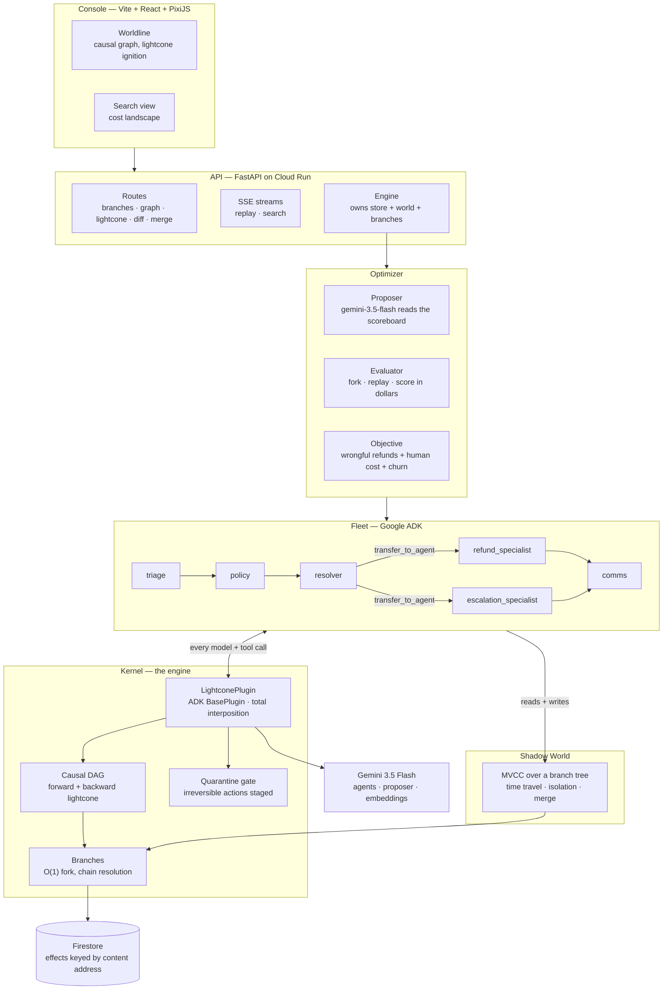

# Architecture

## System



## The mechanism

Everything rests on one interposition point. ADK's `BasePlugin` registers on the `Runner`,
applies to every agent in the fleet, takes precedence over per-agent callbacks, and — the
part that matters — lets a callback return a value that **short-circuits** the real call:

```python
before_model_callback(...) -> Optional[LlmResponse]   # returning one skips the model
before_tool_callback(...)  -> Optional[dict]          # returning one skips the tool
```

So the agent under replay is byte-for-byte the agent that ran in production. No
monkey-patching, no forked framework, no swapped tools.

### Addressing

```
address    = H(kind, agent, [parent addresses], request_hash)   # the request side
content_id = H(address, response)                               # the value side
```

Replay looks up by `address` *before* it has a response. Integrity is checked with
`content_id`. Conflating the two breaks replay.

For a tool that reads world state, the address also folds in a fingerprint of the
collections it declares as its read set — otherwise `search_policy` with an unchanged
query would hit the cache and hand the agent the *old* policy, and the counterfactual
would silently report that nothing changed.

### Two reads, deliberately different

| | honours `fork_at_seq`? | why |
|---|---|---|
| effect lookup | no | an address encodes causal history; a recorded answer is valid wherever it was recorded — and cutting here would throw away every hit after the fork, turning a cheap fork into full re-execution |
| state read | yes | a branch forked at effect 500 must see the world as of effect 500, or it answers a question about a world that never existed |

Cache is about identity. State is about time.

### The run epoch

The fleet writes into collections it also reads — `set_dispute_status` mutates `disputes`,
which `get_dispute` consults. Fingerprinting live state means a recording run changes its
own addresses as it goes, and replay misses everything after the first tool call. Pinning
the fingerprint to a run epoch separates the two kinds of change:

- **exogenous** — a policy edit, written at or before the epoch. *Does* shift the
  fingerprint, and correctly invalidates every decision that consulted it.
- **endogenous** — the fleet's own writes, above the epoch. Already tracked as effects in
  the DAG; folding them into addresses too would double-count and destroy every hit.

## Data flow of one search

1. Production's run is recorded on the base branch. Every candidate inherits it.
2. Gemini proposes N policy variants, reading the measured dollar outcomes so far.
3. Each variant forks the base branch (O(1)), rewrites one clause, and replays the same
   disputes. Intake reasoning is inherited; the policy read and everything downstream
   re-executes.
4. Irreversible actions are staged, not dispatched.
5. Each timeline is scored on the world state it produced.
6. Survivors seed the next generation.
7. The winner can be adopted into production.
