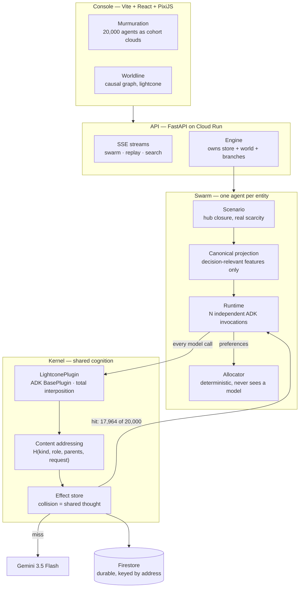

# Architecture

## System



## The mechanism

Everything rests on one interposition point. ADK's `BasePlugin` registers on the `Runner`,
applies to every agent, and — the part that matters — lets a callback **short-circuit** the
real call:

```python
before_model_callback(...) -> Optional[LlmResponse]   # returning one skips the model
before_tool_callback(...)  -> Optional[dict]          # returning one skips the tool
```

So an agent served from the store is byte-for-byte the agent that would have called
Gemini. No monkey-patching, no forked framework, no swapped model.

### Why the sharing is correct

```
address = H(kind, role, [causal parents], canonical request)
```

Three things make a collision mean "these are the same computation" rather than "these
look similar":

1. **The role, not the individual, is the agent name.** Naming agents per-entity would make
   every address unique and defeat sharing entirely.
2. **The request is the canonical projection.** Identity, destination and flight number are
   absent — they decide *which seat* a passenger is matched to, never *what kind of
   itinerary they would accept*.
3. **Causal parents include a round anchor.** Agents reasoning about the same world state
   share it; two rounds facing different scarcity cannot silently share answers.

A naive text cache would be wrong here. Content addressing over full causal history is
what makes it sound.

### The split that keeps it honest

| | | |
|---|---|---|
| **reasoning** | shared | what would someone in this situation accept |
| **matching** | private | which specific seat this specific passenger gets |

Matching depends on identity and live inventory, so it is individual by nature. It never
reaches a model at all — allocation under hard constraints is exactly what deterministic
code is good at, and sending it to a model would be both more expensive and worse.

### Saturation

Distinct situations are bounded by the *product of the buckets*, not by population:

```
tier(4) x urgency(4) x party(4) x constraints(3) = 192 maximum
```

Which is why 20,000 agents need 192 thoughts and 20,000,000 would need the same 192.
Buckets are deliberately coarse: every extra distinction multiplies cost, and a
distinction that does not change the decision buys nothing.

### Two reads, deliberately different

| | honours `fork_at_seq`? | why |
|---|---|---|
| effect lookup | no | an address encodes causal history; a recorded answer is valid wherever it was recorded — and cutting here would throw away every hit after the fork, turning a cheap fork into full re-execution |
| state read | yes | a branch forked at effect 500 must see the world as of effect 500, or it answers a question about a world that never existed |

Cache is about identity. State is about time.

### The run epoch

The fleet writes into collections it also reads — `set_dispute_status` mutates `disputes`,
which `get_dispute` consults. Fingerprinting live state means a recording run changes its
own addresses as it goes, and replay misses everything after the first tool call. Pinning
the fingerprint to a run epoch separates the two kinds of change:

- **exogenous** — a policy edit, written at or before the epoch. *Does* shift the
  fingerprint, and correctly invalidates every decision that consulted it.
- **endogenous** — the fleet's own writes, above the epoch. Already tracked as effects in
  the DAG; folding them into addresses too would double-count and destroy every hit.

## Data flow of one search

1. Production's run is recorded on the base branch. Every candidate inherits it.
2. Gemini proposes N policy variants, reading the measured dollar outcomes so far.
3. Each variant forks the base branch (O(1)), rewrites one clause, and replays the same
   disputes. Intake reasoning is inherited; the policy read and everything downstream
   re-executes.
4. Irreversible actions are staged, not dispatched.
5. Each timeline is scored on the world state it produced.
6. Survivors seed the next generation.
7. The winner can be adopted into production.
